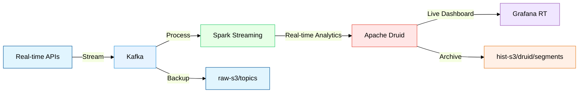
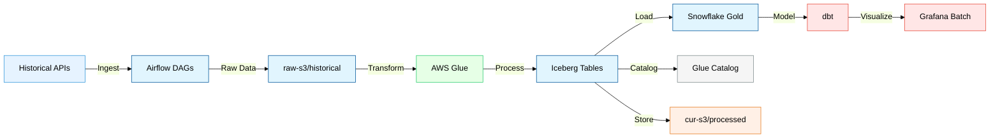

# BetFlow: Real-time Sports Betting Analytics Platform

-----
BetFlow is a modern data and analytics engineering platform designed for real-time sports betting analytics, combining streaming and batch processing capabilities to provide comprehensive insights for sports betting decisions.

### Key Features
- Real-time odds movement tracking and analysis  
- Live game statistics processing
- Weather impact correlation
- Historical pattern recognition
- Market efficiency metrics
- Multi-source data integration
- Automated data quality checks
- Custom analytics dashboards

The platform processes both streaming data for immediate insights and historical data for pattern analysis, providing a complete solution for sports betting analytics.

# Architecture
## 1. Real-time pipeline


### Components
#### 1. Data Sources
- ESPN API for live game statistics
- The Odds API for real-time betting odds
- OpenWeather API for venue weather conditions
#### 2. Message Queue (Kafka)
- KRaft mode for better performance and reliability
- Dedicated topics per sport and data type
- S3 sink connector for data persistence
#### 3. Stream Processing (Spark)
- Structured Streaming for real-time analytics
- Window-based aggregations (3-20 minutes)
- Custom processors for games, odds, and weather
#### 4. Analytics Storage (Druid)
- Sub-second query performance
- Multi-dimensional analytics support
- Native Kafka integration
- Historical data management
#### 5. Visualization (Grafana)
- Real-time dashboards
- Custom metrics and alerts
- Historical trend analysis
### Data Flow
- APIs publish data to respective Kafka topics
- Spark Streaming processes and enriches data
- Druid ingests processed data for analytics
- Grafana visualizes metrics in real-time
### Key Features
- Low-latency data processing (<1 second)
- Fault-tolerant architecture
- Scalable data ingestion
- Historical data persistence
- Real-time analytics and visualization

This pipeline enables comprehensive sports analytics with real-time insights for game analysis, odds movement tracking, and weather impact assessment.

## 2. Batch pipeline


### Components
#### 1. Data Ingestion Layer
- Raw data collection from multiple sports APIs
- Storage in S3 raw bucket (raw-s3/historical/)
- Organized by sport type and data category (games, odds)
#### 2. Processing Layer
- AWS Glue for ETL processing
- Transformation from raw JSON to structured formats
- Implementation of Iceberg tables for data management
- Storage in processed bucket (cur-s3/processed/)
#### 3. Analytics Layer*
- Snowflake integration for analytics processing
- dbt models for data transformation
- Bronze → Silver → Gold layer progression
- Comprehensive data quality checks

### Data Flow
#### 1. Raw Data Collection
- Historical game data ingestion
- Odds data processing
- Structured storage in S3
#### 2. Data Processing
- Raw JSON transformation
- Schema validation and enforcement
- Data quality checks
- Iceberg table management
#### 3. Analytics Processing*
- Snowflake external tables
- dbt transformations
- Business logic implementation
- Analytics-ready views

### Key Features
- Data Organization: Multi-layer storage strategy (Bronze/Silver/Gold)
- Quality Control: Comprehensive data validation
- Scalability: Efficient handling of multiple sports data
- Analytics Ready: Structured for complex analysis
- Maintainable: Clear separation of concerns

[//]: # (```mermaid)

[//]: # (graph TB)

[//]: # (    subgraph "Data Sources")

[//]: # (        A[Iceberg Tables] -->|Load| B[Snowflake External Tables])

[//]: # (    end)

[//]: # (    )
[//]: # (    subgraph "dbt Transformations")

[//]: # (        B -->|Transform| C[Base Models])

[//]: # (        C -->|Aggregate| D[Intermediate Models])

[//]: # (        D -->|Business Logic| E[Gold Tables])

[//]: # (    end)

[//]: # (    )
[//]: # (    subgraph "Analytics")

[//]: # (        E -->|Query| F[BI Dashboards])

[//]: # (        E -->|Analysis| G[ML Models])

[//]: # (    end)

[//]: # (```)

## Analytics Overview*

### Data Analysis Patterns
#### 1. Game Analytics
- Score progression tracking
- Team performance metrics
- Home vs Away performance analysis
- Season-over-season comparisons
- Quarter-by-quarter analysis
#### 2. Odds Analytics
- Line movement tracking
- Market efficiency metrics
- Bookmaker comparison analysis
- Opening vs Closing line analysis
- Volume-weighted average prices
- Odds volatility patterns
#### 3. Cross-Data Analytics
- Weather impact correlations
- News sentiment effects
- Performance-weather patterns
- Multifactor analysis

### Analytical Patterns
#### 1. SCD (Slowly Changing Dimensions)
- Team information tracking
- Venue details management
- Player roster changes
- League structure changes
#### 2. CDC (Change Data Capture)
- Odds movements tracking
- Score updates monitoring
- Weather condition changes
- Real-time market shifts
#### 3. Growth Accounting
- Performance metrics evolution
- Market efficiency trends
- Betting volume patterns
- Season-by-season comparisons

## What Makes BetFlow Different
- **True Real-time Processing**: Leverages Apache Kafka and Spark Streaming for sub-second latency in odds movement analysis and game statistics
- **Dual Pipeline Architecture**: Separate real-time and batch pipelines optimized for their specific use cases
- **Advanced Analytics**: Combines game statistics, odds movements, weather impacts, and news sentiment for comprehensive betting insights
- **Cost-effective Design**: Hybrid storage strategy using Apache Druid for real-time analytics and Snowflake for historical analysis
- **Scalable Architecture**: Cloud-native design supporting multiple sports (NFL, NBA, NHL, NCAAF) and data sources


> ### Ongoing and upcoming implementations
> 1. dbt models, gold layer, and business logic implementation
> 2. Batch grafana dashboard
> 3. Unit and integration tests and corresponding workflows
> 4. Ruff linting and type checking and corresponding workflows
> 5. CI/CD for package `betflow` and corresponding docs
> 6. Asynchronous Kafka orchestrator, one producer for all 
> 7. Weather component in batch pipeline
> 8. Processing DAGs and analytics for data published by Kafka streams
> 9. News component in real-time and batch pipeline
> 10. Series of medium articles (as couple articles won't suffice for this project)


> NOTE: (*) means in progress. 