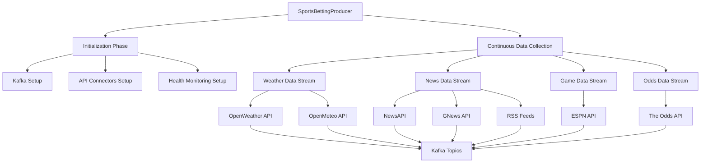

# sports_betting_analytics_engine

```mermaid
graph TD
    A[SportsBettingProducer] --> B[Initialization Phase]
    B --> C[Kafka Setup]
    B --> D[API Connectors Setup]
    B --> E[Health Monitoring Setup]
    
    A --> F[Continuous Data Collection]
    F --> G[Game Data Stream]
    F --> H[Odds Data Stream]
    F --> I[Weather Data Stream]
    F --> J[News Data Stream]
    
    G --> K[ESPN API]
    H --> L[The Odds API]
    
    I --> M[OpenWeather API]
    I --> N[OpenMeteo API]
    
    J --> O[NewsAPI]
    J --> P[GNews API]
    J --> Q[RSS Feeds]
    
    M --> R[Kafka Topics]
    N --> R
    O --> R
    P --> R
    Q --> R
    K --> R
    L --> R
```
