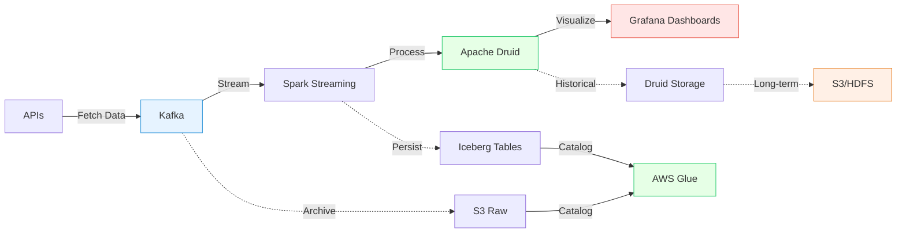
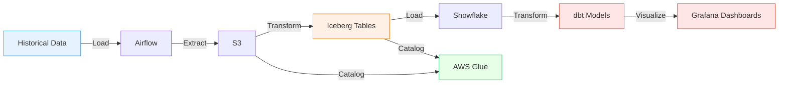

# Sports Betting Analytics Engine

### Real-time pipeline

```mermaid
graph LR
    classDef ingestion fill:#e6f3ff,stroke:#3498db
    classDef processing fill:#e6ffe6,stroke:#2ecc71
    classDef storage fill:#fff0e6,stroke:#e67e22
    classDef visualization fill:#ffe6e6,stroke:#e74c3c
    
    A[APIs] -->|Fetch Data| B[Kafka]
    B -->|Stream| C[Spark Streaming]
    C -->|Process| D[Apache Druid]
    D -->|Visualize| E[Grafana Dashboards]
    
    B -.->|Archive| F[S3 Raw]
    C -.->|Persist| G[Iceberg Tables]
    D -.->|Historical| H[Druid Storage]
    H -.->|Long-term| I[S3/HDFS]
    
    F & G -->|Catalog| J[AWS Glue]
    
    A & B:::ingestion
    C & D:::processing
    F & G & H & I:::storage
    E:::visualization
    J:::processing
```

### Batch pipeline

```mermaid
graph LR
    classDef source fill:#e6f3ff,stroke:#3498db
    classDef processing fill:#e6ffe6,stroke:#2ecc71
    classDef storage fill:#fff0e6,stroke:#e67e22
    classDef analytics fill:#ffe6e6,stroke:#e74c3c
    
    A[Historical Data] -->|Load| B[Airflow]
    B -->|Extract| C[S3]
    C -->|Transform| D[Iceberg Tables]
    D -->|Load| E[Snowflake]
    E -->|Transform| F[dbt Models]
    F -->|Visualize| G[Grafana Dashboards]
    
    C & D -->|Catalog| H[AWS Glue]
    
    A:::source
    B & H:::processing
    C & D:::storage
    E & F:::analytics
    G:::analytics
```
