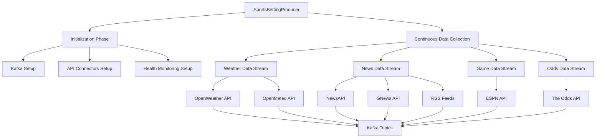
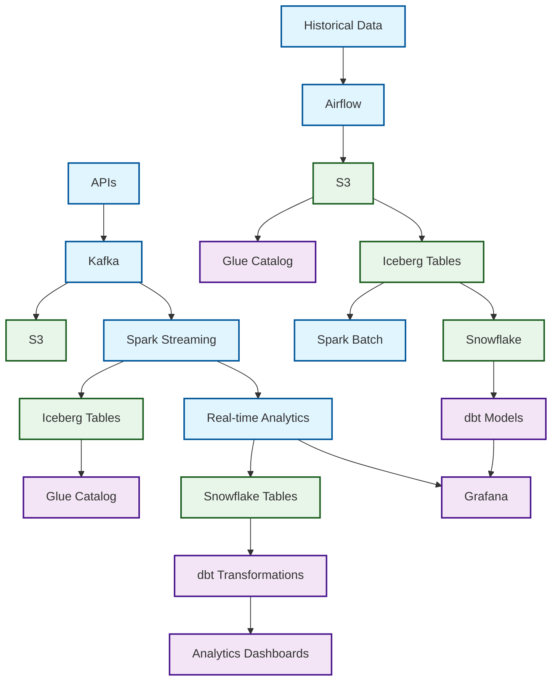
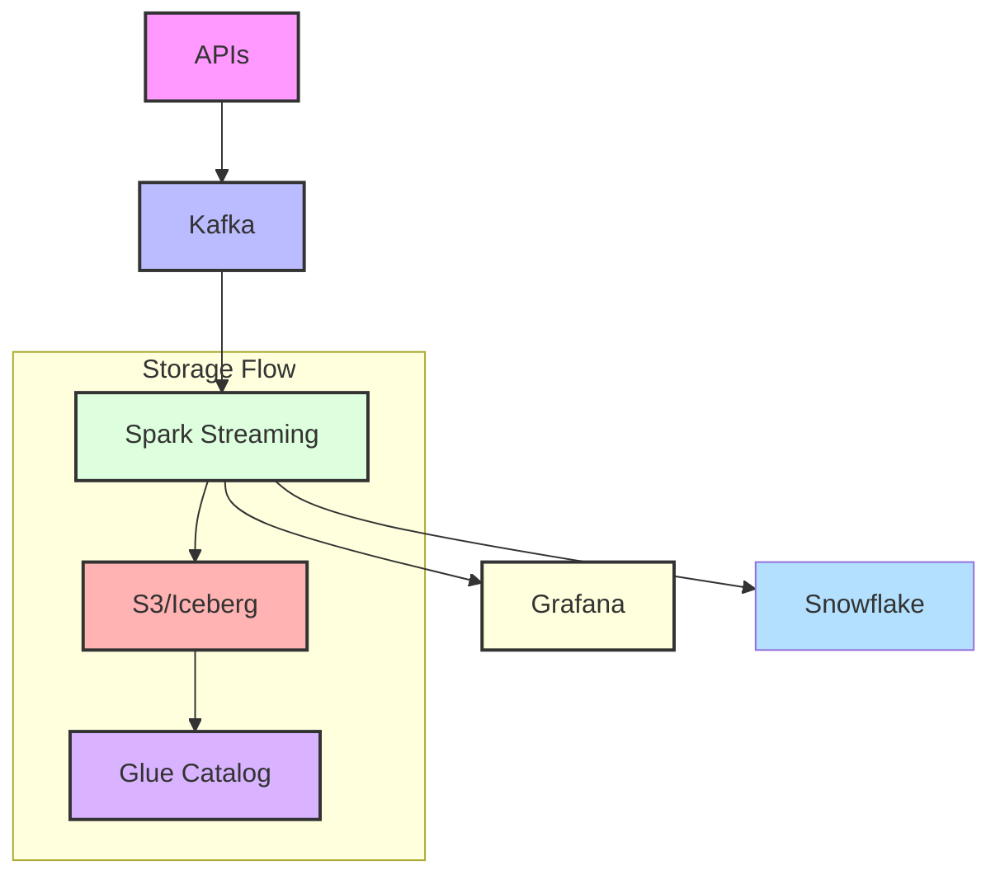
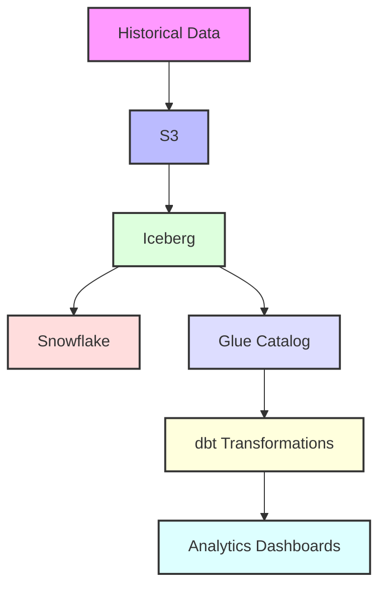
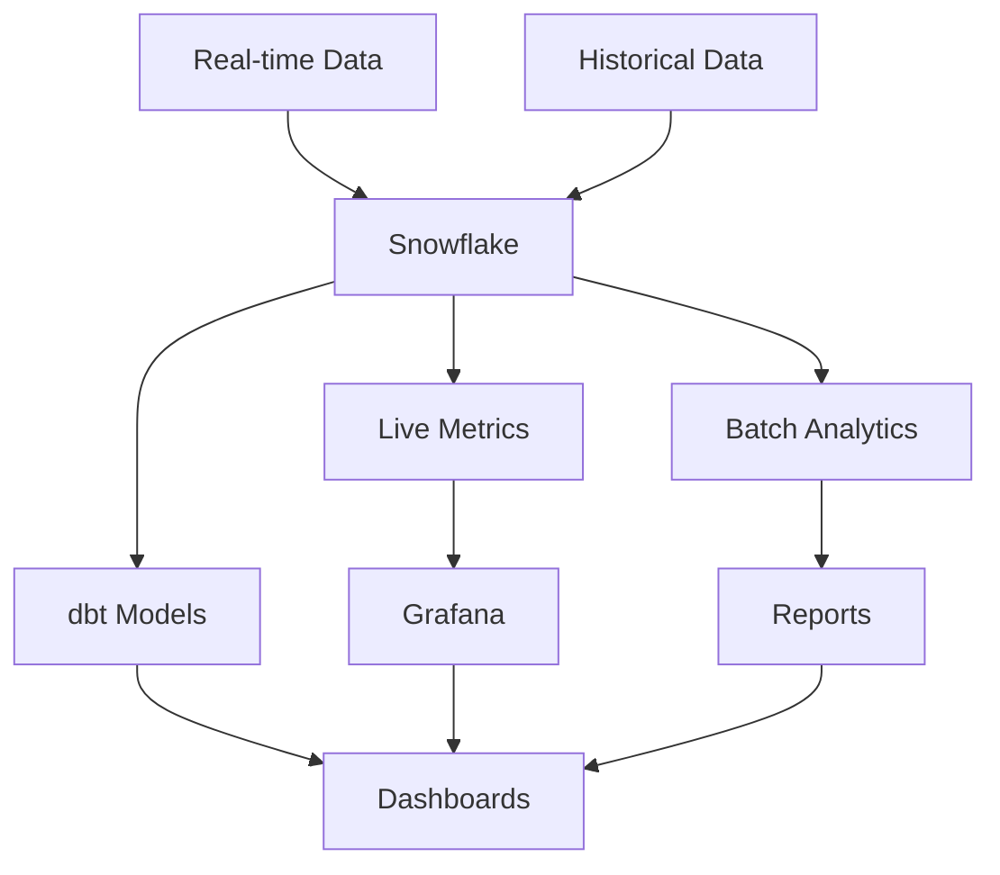
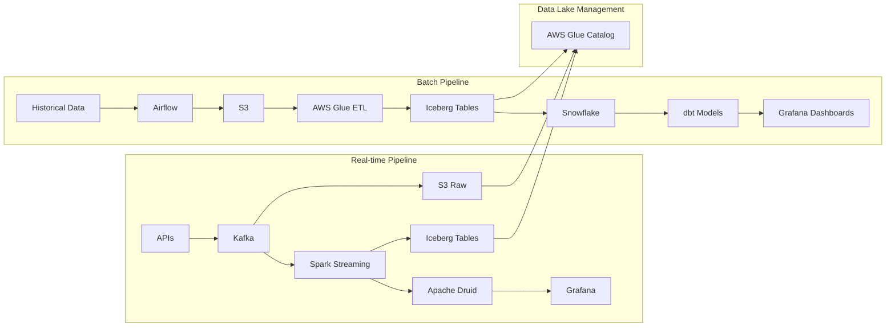

# sports_betting_analytics_engine

### Kafka

```mermaid
graph TD
    A[SportsBettingProducer] --> B[Initialization Phase]
    B --> C[Kafka Setup]
    B --> D[API Connectors Setup]
    B --> E[Health Monitoring Setup]
    
    A --> F[Continuous Data Collection]
    F --> G[Game Data Stream]
    F --> H[Odds Data Stream]
    F --> I[Weather Data Stream]
    F --> J[News Data Stream]
    
    G --> K[ESPN API]
    H --> L[The Odds API]
    
    I --> M[OpenWeather API]
    I --> N[OpenMeteo API]
    
    J --> O[NewsAPI]
    J --> P[GNews API]
    J --> Q[RSS Feeds]
    
    M --> R[Kafka Topics]
    N --> R
    O --> R
    P --> R
    Q --> R
    K --> R
    L --> R
```
### Pipeline

```mermaid
graph TD
    %% Real-time Pipeline
    API[APIs] --> Kafka
    Kafka --> SparkStream[Spark Streaming]
    SparkStream --> RTA[Real-time Analytics]
    RTA --> Grafana
    
    %% Real-time Storage Flow
    Kafka --> S3_RT[S3]
    SparkStream --> IT_RT[Iceberg Tables]
    RTA --> ST_RT[Snowflake Tables]
    
    %% Real-time Processing Flow
    IT_RT --> GC_RT[Glue Catalog]
    ST_RT --> DBT_RT[dbt Transformations]
    DBT_RT --> AD_RT[Analytics Dashboards]
    
    %% Batch Pipeline
    HD[Historical Data] --> Airflow
    Airflow --> S3_B[S3]
    S3_B --> IT_B[Iceberg Tables]
    IT_B --> ST_B[Snowflake]
    
    %% Batch Processing Flow
    S3_B --> GC_B[Glue Catalog]
    IT_B --> SB[Spark Batch]
    ST_B --> DBT_B[dbt Models]
    DBT_B --> Grafana
    
    %% Styling
    classDef primary fill:#e1f5fe,stroke:#01579b,stroke-width:2px
    classDef secondary fill:#f3e5f5,stroke:#4a148c,stroke-width:2px
    classDef storage fill:#e8f5e9,stroke:#1b5e20,stroke-width:2px
    
    class API,Kafka,SparkStream,RTA,HD,Airflow,SB primary
    class S3_RT,S3_B,IT_RT,IT_B,ST_RT,ST_B storage
    class GC_RT,GC_B,DBT_RT,DBT_B,AD_RT,Grafana secondary
```

## Data Flow strategy
### Real-time data

```mermaid
graph TD
    A[APIs] --> B[Kafka]
    B --> C[Spark Streaming]
    C --> D[Grafana]
    C --> E[Snowflake]
    style E fill:#b3e0ff
    
    subgraph Storage Flow
    C --> F[S3/Iceberg]
    F --> G[Glue Catalog]
    end
    
    style A fill:#f9f,stroke:#333,stroke-width:2px
    style B fill:#bbf,stroke:#333,stroke-width:2px
    style C fill:#dfd,stroke:#333,stroke-width:2px
    style D fill:#ffd,stroke:#333,stroke-width:2px
    style F fill:#ffb3b3,stroke:#333,stroke-width:2px
    style G fill:#d9b3ff,stroke:#333,stroke-width:2px
```
### Batch data

```mermaid
graph TD
    A[Historical Data] --> B[S3]
    B --> C[Iceberg]
    C --> D[Snowflake]
    C --> E[Glue Catalog]
    E --> F[dbt Transformations]
    F --> G[Analytics Dashboards]

    style A fill:#f9f,stroke:#333,stroke-width:2px
    style B fill:#bbf,stroke:#333,stroke-width:2px
    style C fill:#dfd,stroke:#333,stroke-width:2px
    style D fill:#fdd,stroke:#333,stroke-width:2px
    style E fill:#ddf,stroke:#333,stroke-width:2px
    style F fill:#ffd,stroke:#333,stroke-width:2px
    style G fill:#dff,stroke:#333,stroke-width:2px
```
## Hybrid

```mermaid
graph TD
    RT[Real-time Data] --> SF[Snowflake]
    HD[Historical Data] --> SF
    SF --> LM[Live Metrics]
    SF --> DM[dbt Models]
    SF --> BA[Batch Analytics]
    LM --> GR[Grafana]
    DM --> DB[Dashboards]
    BA --> RP[Reports]
    GR --> DB
    RP --> DB
```

## New

```mermaid
graph LR
    subgraph "Real-time Pipeline"
        A[APIs] --> B[Kafka]
        B --> C[Spark Streaming]
        C --> D[Apache Druid]
        D --> E[Grafana]
        B --> F[S3 Raw]
        C --> G[Iceberg Tables]
    end

    subgraph "Batch Pipeline"
        H[Historical Data] --> I[Airflow]
        I --> J[S3]
        J --> K[AWS Glue ETL]
        K --> L[Iceberg Tables]
        L --> M[Snowflake]
        M --> N[dbt Models]
        N --> O[Grafana Dashboards]
    end

    subgraph "Data Lake Management"
        F --> P[AWS Glue Catalog]
        G --> P
        L --> P
    end
```
