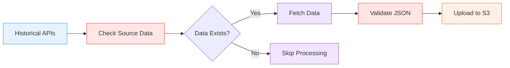
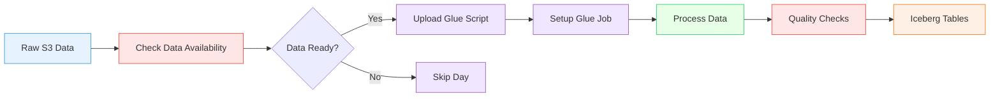
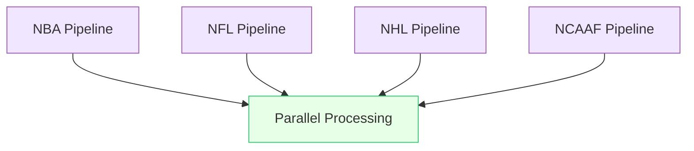

# DAGs

## 1. Ingestion DAG

```mermaid
graph LR
    classDef source fill:#e6f3ff,stroke:#3498db
    classDef validation fill:#ffe6e6,stroke:#e74c3c
    classDef storage fill:#fff0e6,stroke:#e67e22
    classDef processing fill:#e6ffe6,stroke:#2ecc71
    classDef task fill:#f0e6ff,stroke:#9b59b6

%%    subgraph ""
        A[Historical APIs]:::source --> B[Check Source Data]:::validation
        B --> C{Data Exists?}
        C -->|Yes| D[Fetch Data]:::task
        D --> E[Validate JSON]:::validation
        E --> F[Upload to S3]:::storage
        C -->|No| G[Skip Processing]:::task
%%    end
```

## 2. Processing DAG

```mermaid
graph LR
    classDef source fill:#e6f3ff,stroke:#3498db
    classDef validation fill:#ffe6e6,stroke:#e74c3c
    classDef storage fill:#fff0e6,stroke:#e67e22
    classDef processing fill:#e6ffe6,stroke:#2ecc71
    classDef task fill:#f0e6ff,stroke:#9b59b6
    
%%    subgraph "Processing DAG"
        H[Raw S3 Data]:::source --> I[Check Data Availability]:::validation
        I --> J{Data Ready?}
        J -->|Yes| K[Upload Glue Script]:::task
        K --> L[Setup Glue Job]:::task
        L --> M[Process Data]:::processing
        M --> N[Quality Checks]:::validation
        N --> O[Iceberg Tables]:::storage
        J -->|No| P[Skip Day]:::task
%%    end
```

## 3. Task Groups

```mermaid
graph TB
    classDef source fill:#e6f3ff,stroke:#3498db
    classDef validation fill:#ffe6e6,stroke:#e74c3c
    classDef storage fill:#fff0e6,stroke:#e67e22
    classDef processing fill:#e6ffe6,stroke:#2ecc71
    classDef task fill:#f0e6ff,stroke:#9b59b6
    
%%    subgraph "Task Groups"
        Q[NBA Pipeline]:::task
        R[NFL Pipeline]:::task
        S[NHL Pipeline]:::task
        T[NCAAF Pipeline]:::task
        
        Q & R & S & T --> U[Parallel Processing]:::processing
%%    end
```