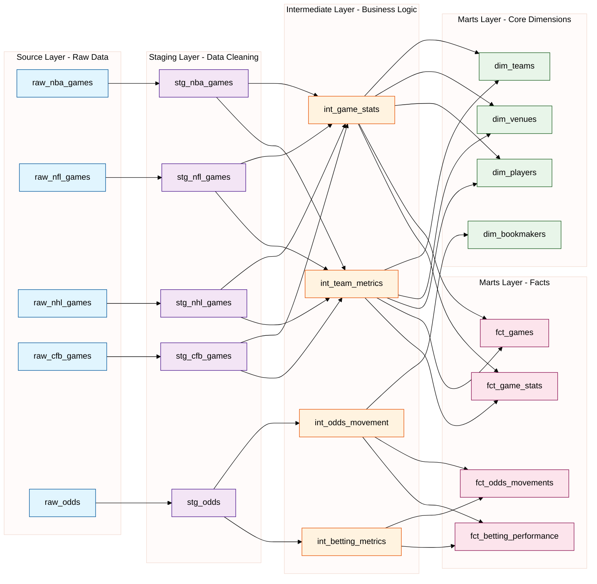

# dbt Analytics Pipeline Structure*

## Data Flow Layers
### 1. Source Layer (External Tables)
- Raw games data from Iceberg
- Raw odds data from Iceberg
- Raw weather data from Iceberg
- Raw news data from Iceberg
### 2. Staging Layer (Basic Transformations)
- Standardized game events
- Normalized odds movements
- Cleaned weather metrics
- Processed news events
### 3. Intermediate Layer (Business Logic)
- Game performance metrics
- Market efficiency calculations
- Weather impact analysis
- News sentiment scores
### 4. Marts Layer (Analytics Ready)
- Core gaming facts
- Betting analytics
- Performance insights
- Cross-domain analysis

## Analytics Models
### 1. Core Analytics
- Team performance tracking
- Player statistics aggregation
- Venue impact analysis
- Season progression metrics
### 2. Betting Analytics
- Market efficiency metrics
- Bookmaker comparison
- Line movement patterns
- Value betting opportunities
### 3. Cross-Domain Analytics
- Weather impact on performance
- News sentiment effect on odds
- Multifactor correlation analysis
- Predictive modeling features